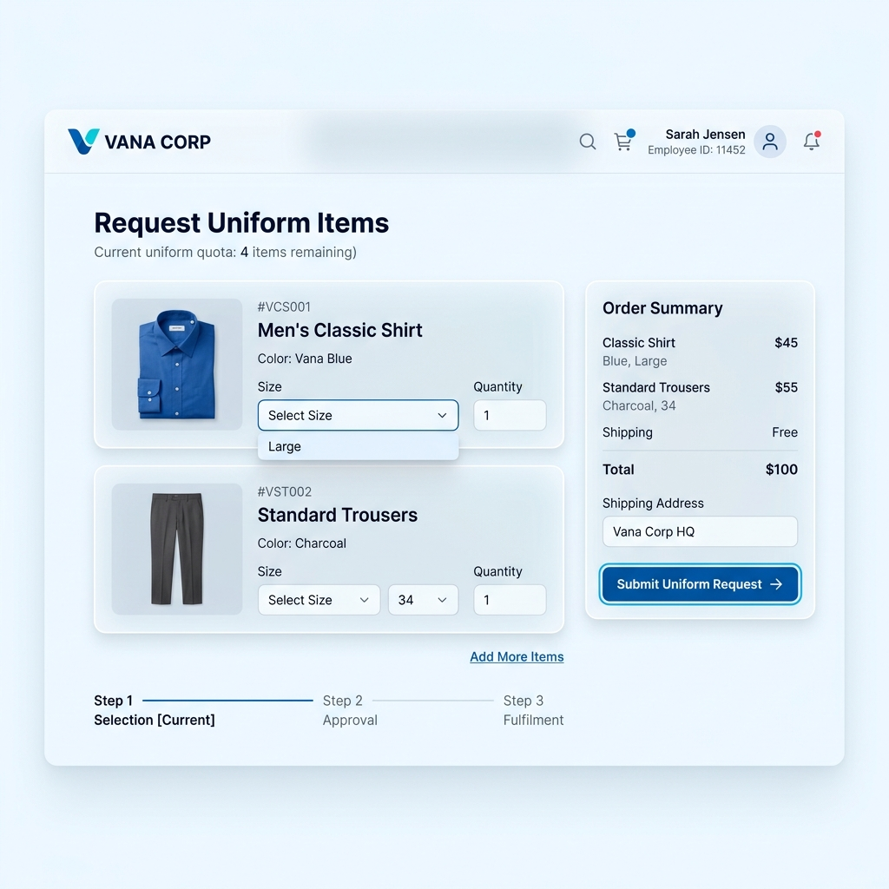
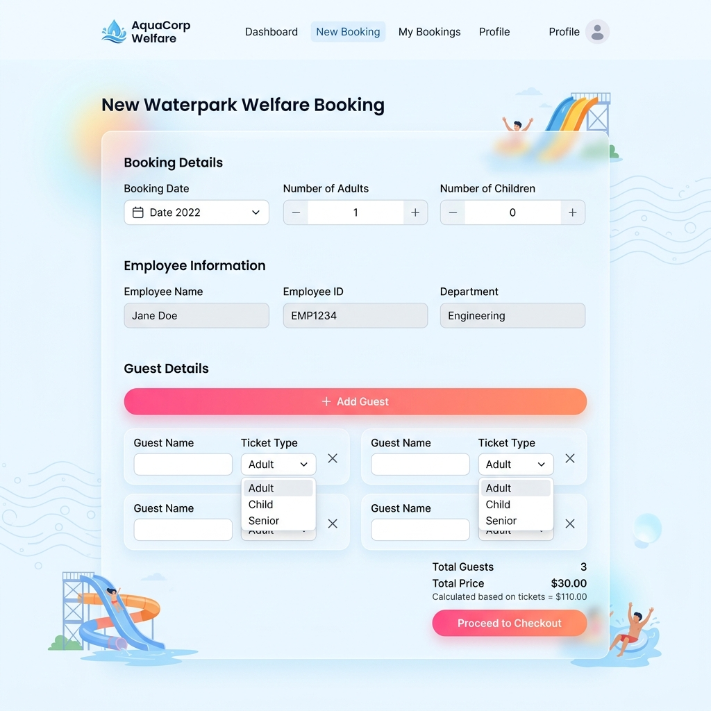
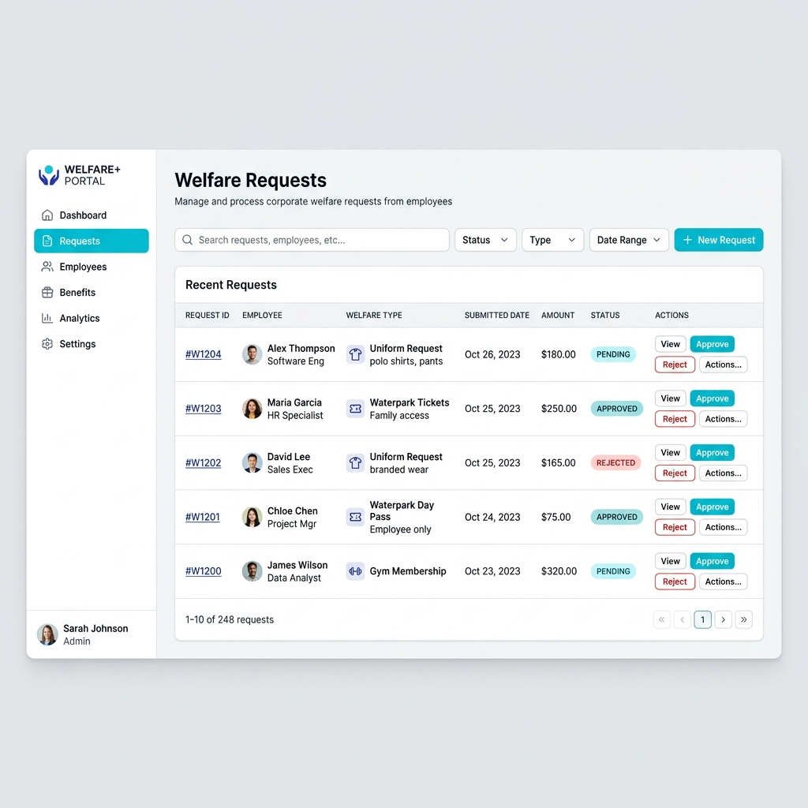

# 📖 คู่มือการใช้งานระบบ Vana Welfare System
ยินดีต้อนรับเข้าสู่ระบบจัดการสวัสดิการพนักงาน (Vana Welfare System) ระบบนี้ถูกออกแบบมาเพื่ออำนวยความสะดวกให้พนักงานในการทำเรื่อง **เบิกชุดยูนิฟอร์ม** และ **ขอรับสิทธิ์เข้าสวนน้ำ** รวมถึงระบบการจัดการข้อมูลสำหรับฝ่ายบุคคล/ผู้ดูแล (Admin) แบบครบวงจร

---

## 1. 👕 ระบบเบิกชุดยูนิฟอร์ม (Uniform Request)

ระบบเบิกชุดช่วยให้พนักงานสามารถสั่งเบิกชุดพนักงานตามจำนวนโควตาที่ได้รับได้อย่างง่ายดาย โดยมีขั้นตอนดังนี้:

### ขั้นตอนการใช้งานสำหรับพนักงาน
1. **เข้าสู่ระบบ:** พนักงานเข้าสู่ระบบด้วยรหัสพนักงาน/Username
2. **เลือกประเภทการเบิก:** เลือกว่าเป็นการเบิกชุดใหม่ (ปีแรก) หรือชุดทดแทน
3. **เลือกไซส์และจำนวน:** เลือกประเภทเสื้อผ้า (เสื้อเชิ้ต, กางเกง ฯลฯ) ระบุไซส์ และกรอกจำนวนที่ต้องการ
   - *ระบบจะคำนวณและแสดงให้เห็นว่าเบิกได้อีกกี่ชุดตามสิทธิ์*
4. **ระบุเงื่อนไขพิเศษ (ถ้ามี):** หากเป็นการส่งคืนเพื่อเปลี่ยนชุดชำรุด ให้ระบุเหตุผลและอัปโหลดรูปภาพ
5. **กดยืนยันการเบิก:** ข้อมูลจะถูกส่งตรงไปยังระบบหลังบ้านเพื่อรอการอนุมัติ

> [!TIP]
> **เช็คสถานะการเบิก:** พนักงานสามารถกดสลับแท็บไปที่ **"ประวัติการเบิก"** เพื่อติดตามว่าชุดที่สั่งเบิกไปนั้นกำลังอยู่ในสถานะใด (รอดำเนินการ, อนุมัติแล้ว, หรือปฏิเสธ)

---

## 2. 🌊 ระบบสวัสดิการเข้าสวนน้ำ (Waterpark Welfare)

ระบบจองสิทธิ์เข้าสวนน้ำ ช่วยให้พนักงานสามารถลงทะเบียนให้ตนเองและผู้ติดตามเข้าสวนน้ำล่วงหน้า โดยคำนวณโควตาบัตรฟรี/บัตรส่วนลดให้อัตโนมัติ

### ขั้นตอนการจองสิทธิ์เข้าสวนน้ำ
1. **เลือกวันที่:** ระบุวันที่ต้องการจะเข้าไปใช้บริการ
2. **เลือกสิทธิ์ของพนักงาน:** ระบุว่าพนักงานจะ **"เข้าด้วย"** หรือ **"ไม่เข้า (ให้สิทธิ์เฉพาะผู้ติดตาม)"**
3. **เพิ่มผู้ติดตาม:**
   - กรอกชื่อ-สกุล และเลขบัตรประชาชน 13 หลักของผู้ติดตาม
   - ระบบจำประวัติญาติที่เคยลงทะเบียนไว้ ทำให้ไม่ต้องกรอกใหม่ในครั้งถัดไป
4. **ตรวจสอบสิทธิ์และกดยืนยัน:** ระบบจะคำนวณสิทธิ์บัตรฟรีและบัตรส่วนลดตามโควตาคงเหลือ เมื่อข้อมูลครบถ้วนแล้ว ให้กดปุ่มยืนยัน

> [!IMPORTANT]
> - พนักงานในเครือที่ได้รับการยืนยันแล้ว สามารถเข้าใช้งานเพื่อกรอกข้อมูลผู้ติดตามได้เลย
> - **สำหรับพนักงานระดับผู้จัดการขึ้นไป** จะมีสิทธิ์ใช้งานแท็บพิเศษ "จัดการรายชื่อญาติ" เพื่อลบหรือแก้ไขชื่อผู้ติดตามในระบบได้เอง

---

## 3. ⚙️ ระบบหลังบ้านสำหรับผู้ดูแล (Admin Dashboard)

หน้าต่างจัดการเฉพาะสำหรับ **ผู้ดูแลระบบ (Admin)** ซึ่งสามารถมองเห็นภาพรวม จัดการสต๊อก และกดอนุมัติคำขอต่างๆ ได้ในที่เดียว

### 3.1 การอนุมัติและการจัดการสต๊อก (Uniform)
- **จัดการคำขอเบิก:** แอดมินสามารถดูรายการที่พนักงานขอเบิก และกดปุ่ม **"อนุมัติ"** หรือ **"ปฏิเสธ"** ได้ทันที
- **จัดการคลังสินค้า (Stock):** สามารถเพิ่มหรือลดยอดจำนวนเสื้อผ้าและกางเกงแต่ละไซส์ที่มีในคลังได้ หากสต๊อกไม่พอ ระบบจะไม่ให้พนักงานเบิกไซส์นั้นๆ

### 3.2 การจัดการสวนน้ำรายเดือน (Waterpark History)
- **ภาพรวมแบบรายเดือน:** เมื่อคลิกที่แท็บสวนน้ำ แอดมินจะเห็น **การ์ดสรุปยอดรายวัน** ของทั้งเดือน (บอกยอดรวมพนักงานและผู้ติดตาม)
- **เจาะลึกรายวัน:** เมื่อคลิกที่การ์ดของแต่ละวัน หน้าจอจะแสดง **ตารางรายชื่อแบบละเอียด** 
- **พิมพ์ใบลงนาม (PDF):** สามารถกดปุ่มพิมพ์เพื่อปรินท์ใบเซ็นรับบัตรให้พนักงานเซ็นหน้างานได้ทันที

> [!WARNING]
> การกดยกเลิกการจองสิทธิ์สวนน้ำ หรือลบรายชื่อผู้ติดตามออกจากการจอง ระบบจะคืนสิทธิ์ (Quota) บัตรฟรีหรือส่วนลดนั้นๆ กลับไปให้พนักงานโดยอัตโนมัติ

---
**หมายเหตุ:** คู่มือนี้จัดทำขึ้นสำหรับ Vana Welfare System v2.0 หากพบปัญหาในการใช้งาน สามารถติดต่อฝ่าย IT Support ของบริษัทได้ตลอดเวลาครับ
